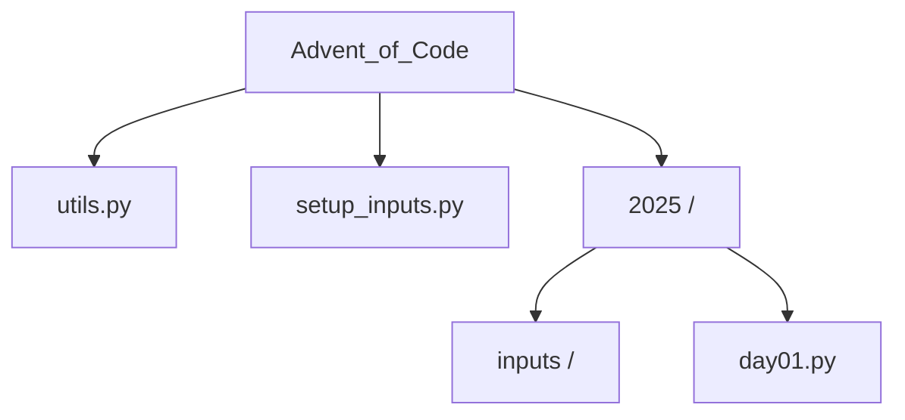

# Advent of Code Solutions

Monorepo for my [Advent of Code](https://adventofcode.com/) solutions.

## Structure


### Instructions

- setup_inputs.py: Downloads inputs for the year.

- utils.py: Shared helpers (input reading, grid parsing, math).

- inputs/: Auto-generated folder (ignored by Git).

### How to get the input data with setup_inputs.py:

1. ```pip install advent-of-code-data```
2. Download Inputs:
- Run this once per year (requires session cookie):

 ```python setup_inputs.py 2025 ```
