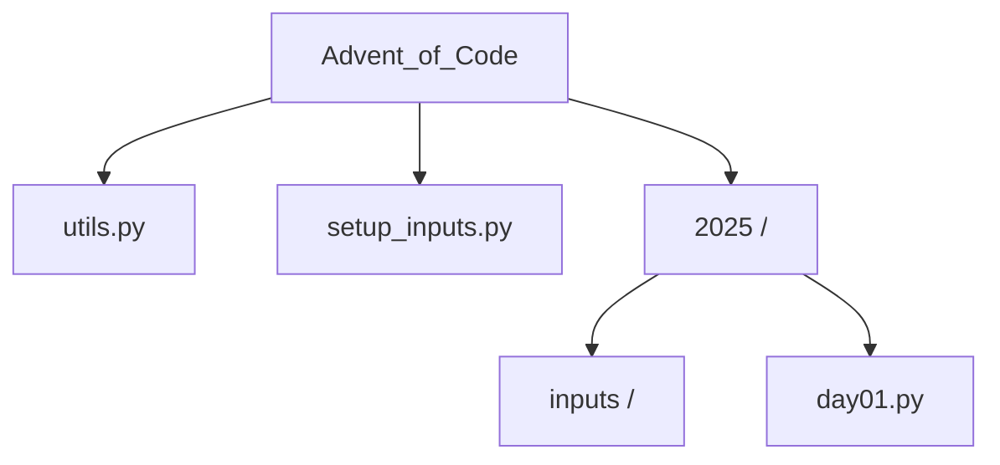

# Advent of Code Solutions

Monorepo for my [Advent of Code](https://adventofcode.com/) solutions.

## Structure

### Instructions

setup_inputs.py: Downloads inputs for the year.

utils.py: Shared helpers (input reading, grid parsing, math).

inputs/: Auto-generated folder (ignored by Git).
